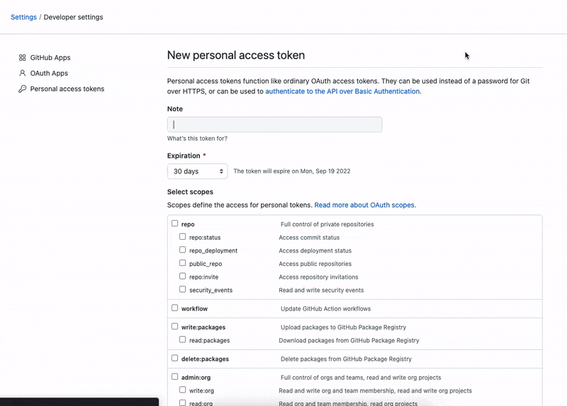

## How to get Github token?

### Why do Pocket CI needs this token?
You will need GitHub token to view your GitHub action builds in this project. Pocket CI will use this token to fetch repositories, builds and artifact related information from your GitHub account. This token can be unauthorised _(deleted)_ from the GitHub website anytime to stop access to this data. Pocket CI stores this token securely in the local storage of your phone. The token you enter, will never leave your phone.

### How to generate this token?

Follow [this](https://docs.github.com/en/enterprise-server@3.4/authentication/keeping-your-account-and-data-secure/creating-a-personal-access-token) guide to create a new token from your GitHub account settings. 

While creating the token you will need to grant following permissions/scopes to allow Pocket CI to work properly:
- workflow
- read:user

----
> If you have any questions or suggestions about this page, feel free to open a [discussion under `documentation`](https://github.com/kevalpatel2106/pocket-ci/discussions/new?category=documentation).
